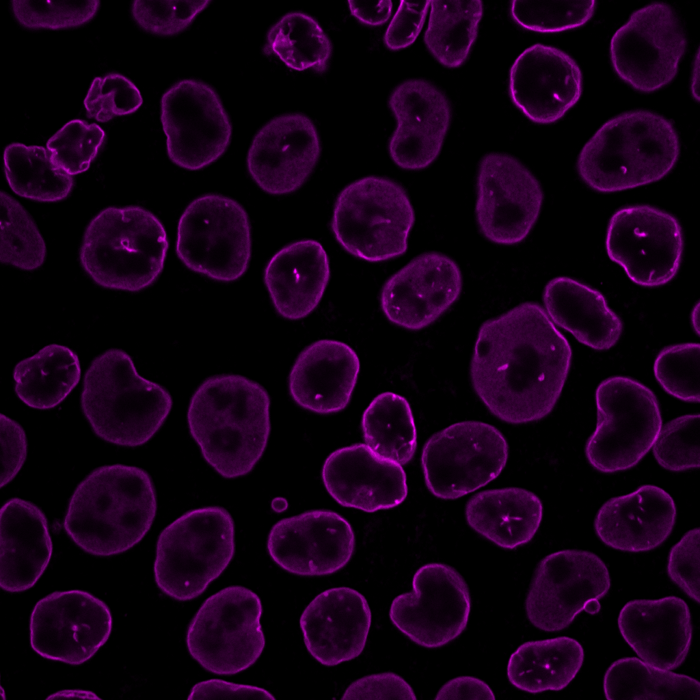
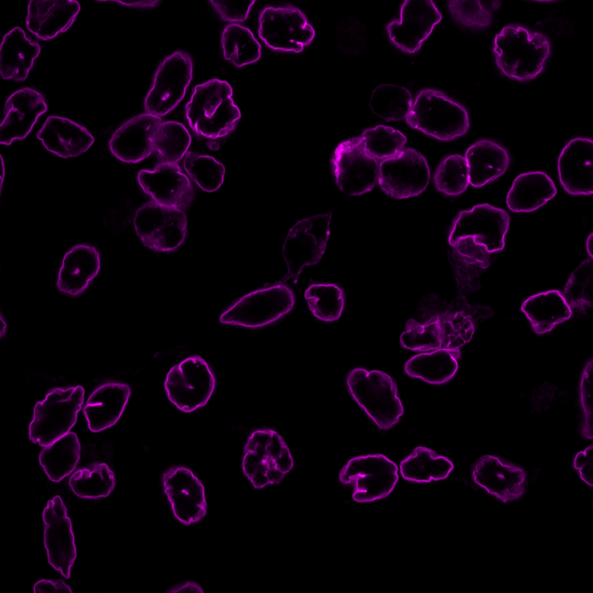
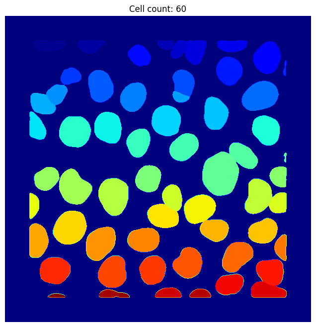
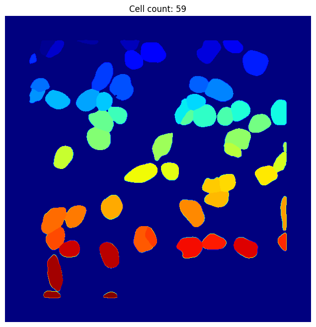
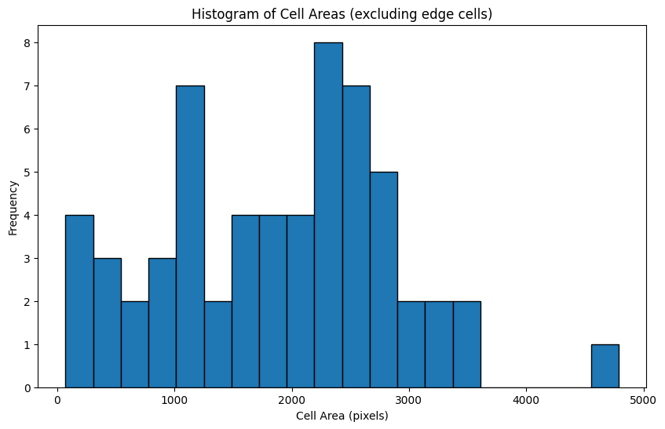
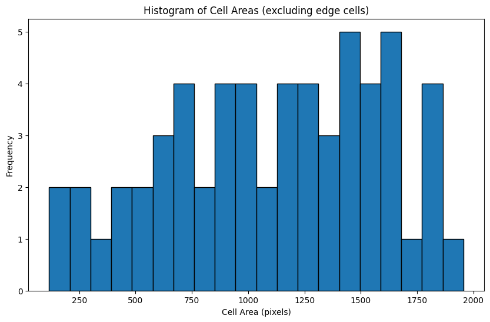

# Cellpose-easy：Cell Segmentation and Analysis with Cellpose


---

This project uses Cellpose and scikit-image to segment and analyze cells in an image, specifically calculating the cell count and areas while excluding edge cells.

## Project Overview

The main purpose of this project is to:
1. Segment cells in a given image using the Cellpose model.
2. Count the number of segmented cells, excluding those on the edges.
3. Calculate the area of each cell and display a histogram of cell areas.

### Requirements

To run this project, you will need:
- Python 3.x
- Cellpose
- scikit-image
- NumPy
- Matplotlib

Install the necessary libraries:

```bash
pip install cellpose
pip install scikit-image
```

## Steps

### 1. Import Necessary Libraries

```python
from cellpose import models, io
from skimage import measure
import numpy as np
import matplotlib.pyplot as plt
```

### 2. Load the Image and Set Up the Cellpose Model

Specify the path of the image you want to analyze:

```python
image_path = '/content/outline before.png' #Insert the image path you want
model = models.Cellpose(gpu=True, model_type='cyto')  # Using the 'cyto' model
img = io.imread(image_path)
```

### 3. Segment the Image

Run the segmentation using Cellpose:

```python
masks, flows, styles, diams = model.eval(img, diameter=None, flow_threshold=0.4, cellprob_threshold=0.0)
```

### 4. Calculate Cell Count and Area, Excluding Edge Cells

Analyze each segmented region and exclude cells located on the edges of the image:

```python
props = measure.regionprops(masks)
cell_areas = []
for prop in props:
    minr, minc, maxr, maxc = prop.bbox
    if minr > 0 and minc > 0 and maxr < masks.shape[0] and maxc < masks.shape[1]:
        cell_areas.append(prop.area)
cell_count = len(cell_areas)
```

Output the results:

```python
print(f"Total cell count (excluding edge cells): {cell_count}")
print(f"Cell areas (in pixels, excluding edge cells): {cell_areas}")
print(f"Average cell area: {np.mean(cell_areas):.2f} pixels")
```

### 5. Visualize the Segmentation Results

Display the segmented image with a title indicating the cell count:

```python
plt.figure(figsize=(8, 8))
plt.imshow(masks, cmap='jet')
plt.title(f"Cell count: {cell_count}")
plt.axis('off')
plt.show()
```

### 6. Plot Histogram of Cell Areas

Display a histogram showing the distribution of cell areas:

```python
plt.figure(figsize=(10, 6))
plt.hist(cell_areas, bins=20, edgecolor='black')
plt.title("Histogram of Cell Areas (excluding edge cells)")
plt.xlabel("Cell Area (pixels)")
plt.ylabel("Frequency")
plt.show()
```

## Results

- **Total Cell Count** (excluding edge cells): Displays the number of segmented cells.
- **Average Cell Area**: Provides the average area of the cells.
- **Histogram**: Shows the distribution of cell areas, excluding edge cells.

## Example Output

Below is an example of the segmented image and the histogram of cell areas.

# Cell Segmentation and Analysis with Cellpose

本项目展示了实验前后的图像、细胞轮廓识别、分割结果以及细胞面积的柱状统计图。

### 实验前后图像对比

<div align="center">
    
    <p>图 1. 实验前的图像</p>
</div>

<div align="center">
    
    <p>图 2. 实验后的图像</p>
</div>


### 实验前后图像对比

<div align="center">
    
    
    <p>图 1. 实验前的图像 &nbsp;&nbsp;&nbsp;&nbsp; 图 2. 实验后的图像</p>
</div>

### 细胞识别和分割结果

<div align="center">
    
    
    <p>图 3. 实验前的图像识别轮廓 &nbsp;&nbsp;&nbsp;&nbsp; 图 4. 实验后的图像识别轮廓</p>
</div>

<div align="center">
    
    
    <p>图 5. 实验前的图像分割识别 &nbsp;&nbsp;&nbsp;&nbsp; 图 6. 实验后的图像分割识别</p>
</div>

### 细胞面积的柱状统计图

<div align="center">
    
    
    <p>图 7. 实验前的图像面积柱状统计 &nbsp;&nbsp;&nbsp;&nbsp; 图 8. 实验后的图像面积柱状统计</p>
</div>


This README provides a step-by-step guide to reproducing the analysis, with details on installation, setup, and execution.
